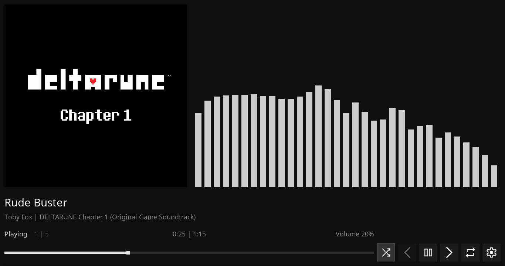
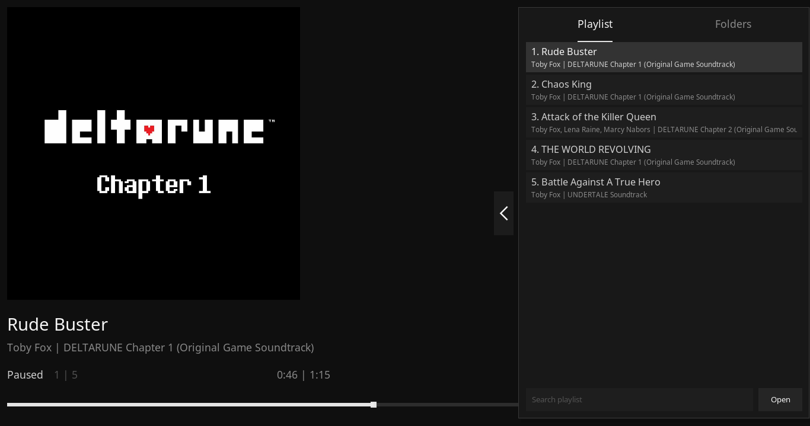
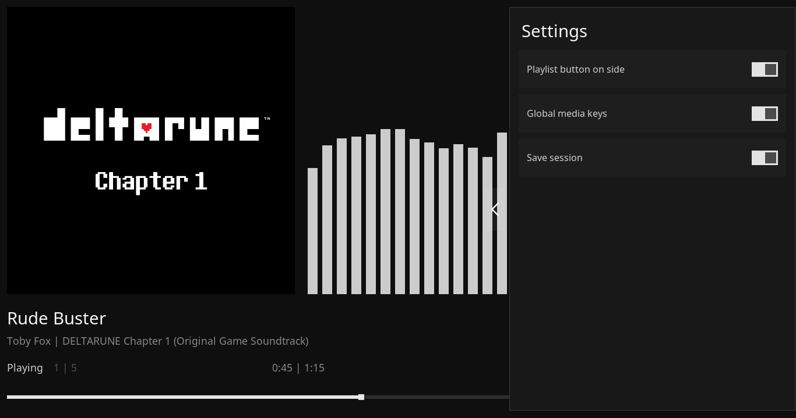
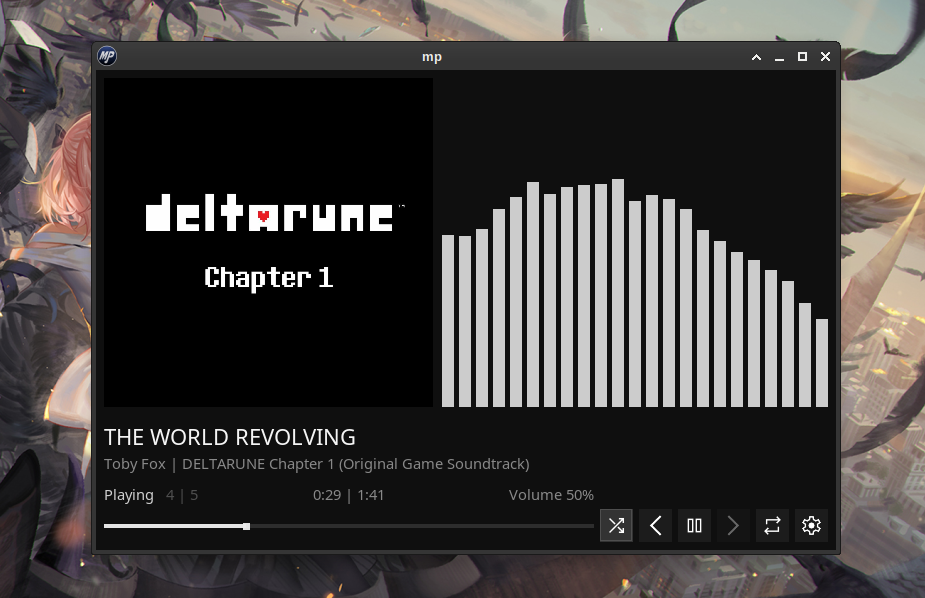

# mp

<p align="center">
  
</p>

<p align="center">A small, fast desktop music player.</p>

<p align="center">
  <a href="https://github.com/kurumihere/mp/blob/master/LICENSE"></a>&nbsp;&nbsp;<a href="https://github.com/kurumihere/mp/releases/latest"></a>&nbsp;&nbsp;<a href="https://github.com/kurumihere/mp/actions/workflows/build.yml"></a>
</p>

<p align="center">
  <a href="#download">Download</a> |
  <a href="#features">Features</a> |
  <a href="#controls">Controls</a> |
  <a href="#build-from-source">Build from source</a>
</p>

<p align="center">
  
</p>

## About

`mp` is a simple desktop music player written in C. It uses [raylib] for the
interface and [miniaudio] for decoding and playback.

The project aims to provide a focused player with a small, native application
feel, without requiring a large desktop music library or a background service.

## Features

- Play FLAC, MP3, and WAV files.
- Open individual files, folders, or M3U playlists.
- Add music by dragging files and folders into the player.
- Search tracks in the current playlist.
- Shuffle playback and repeat one track or the whole playlist.
- Display embedded album art and a playback spectrum.
- Save and load M3U playlists.
- Remember the playback session, volume, and current track.
- Use global media keys where supported by the platform.
- Choose light and dark interface themes.
- Run on Linux, Windows, and macOS.

## Screenshots

<p align="center">
  
</p>

<p align="center">
  
</p>

<p align="center">
  
</p>

## Download

The latest release is [v0.2.1](https://github.com/kurumihere/mp/releases/tag/v0.2.1).

### Windows

- [Installer](https://github.com/kurumihere/mp/releases/download/v0.2.1/mp-0.2.1-windows-x86_64-setup.exe)
- [Portable archive](https://github.com/kurumihere/mp/releases/download/v0.2.1/mp-0.2.1-windows-x86_64.zip)

### Linux

- [AppImage](https://github.com/kurumihere/mp/releases/download/v0.2.1/mp-0.2.1-linux-x86_64.AppImage)
- [Debian package](https://github.com/kurumihere/mp/releases/download/v0.2.1/mp-0.2.1-linux-x86_64.deb)
- [RPM package](https://github.com/kurumihere/mp/releases/download/v0.2.1/mp-0.2.1-linux-x86_64.rpm)
- [Arch Linux AUR package](https://aur.archlinux.org/packages/mp-player-bin)
- [Archive](https://github.com/kurumihere/mp/releases/download/v0.2.1/mp-0.2.1-linux-x86_64.tar.gz)

### macOS

- [DMG](https://github.com/kurumihere/mp/releases/download/v0.2.1/mp-0.2.1-macos-arm64.dmg)
- [Archive](https://github.com/kurumihere/mp/releases/download/v0.2.1/mp-0.2.1-macos-arm64.tar.gz)

## Build from source

The build system bootstraps itself with a C compiler and builds the application
with [nob](https://github.com/tsoding/nob.h), a small C-based build tool.

### Requirements

You need:

- A C compiler
- `pkg-config`
- FreeType 2
- GLib 2
- OpenGL and the platform windowing libraries

### Arch Linux

```sh
sudo pacman -Syu --needed \
    base-devel \
    git \
    pkgconf \
    freetype2 \
    glib2 \
    mesa \
    libglvnd \
    libx11 \
    libxcursor \
    libxi \
    libxinerama \
    libxrandr
```

### Debian / Ubuntu

```sh
sudo apt update
sudo apt install --no-install-recommends \
    build-essential \
    git \
    pkg-config \
    libfreetype6-dev \
    libglib2.0-dev \
    libgl1-mesa-dev \
    libx11-dev \
    libxcursor-dev \
    libxi-dev \
    libxinerama-dev \
    libxrandr-dev
```

### Fedora

```sh
sudo dnf install \
    gcc \
    git \
    pkgconf-pkg-config \
    freetype-devel \
    glib2-devel \
    mesa-libGL-devel \
    libX11-devel \
    libXcursor-devel \
    libXi-devel \
    libXinerama-devel \
    libXrandr-devel
```

### Windows

Install [MSYS2](https://www.msys2.org/) and use the **MSYS2 UCRT64** terminal.
Do not build from the plain MSYS terminal, PowerShell, or Command Prompt.

```sh
pacman -Syu
pacman -S --needed \
    git \
    mingw-w64-ucrt-x86_64-gcc \
    mingw-w64-ucrt-x86_64-freetype \
    mingw-w64-ucrt-x86_64-glib2 \
    mingw-w64-ucrt-x86_64-pkgconf
```

### macOS

Install the Xcode Command Line Tools and [Homebrew](https://brew.sh/):

```sh
xcode-select --install
brew install freetype glib pkgconf
```

### Compile

```sh
git clone https://github.com/kurumihere/mp.git
cd mp

cc -std=c99 -o nob nob.c
./nob
```

The executable is written to `build/mp` on Linux and macOS, or
`build/mp.exe` on Windows.

## Usage

Build and launch the player:

```sh
./nob run
```

Open audio files, folders, or playlists directly:

```sh
./nob run ~/Music
./nob run ~/Music/album.flac
./nob run ~/Music/favorites.m3u
```

You can also add files and folders from the file picker or drag them into the
player window.

## Controls

The most frequently used keyboard shortcuts are:

| Action | Shortcut |
| --- | --- |
| Search playlist | `Ctrl+F` |
| Toggle repeat mode | `R` |
| Toggle shuffle | `S` |
| Toggle playlist sidebar | `L` |
| Open settings | `Q` |

Playback can also be controlled with the buttons in the player, the seek bar,
and supported system media keys.

## Configuration and data

`mp` stores its configuration and playback session in the platform's standard
user data directory. The exact path is platform-dependent.

## Contributing

Bug reports, feature requests, and pull requests are welcome. Please open an
[issue](https://github.com/kurumihere/mp/issues) before starting a large change
so the direction can be discussed first.

[miniaudio]: https://github.com/mackron/miniaudio
[raylib]: https://www.raylib.com/
